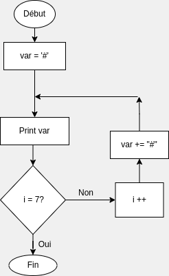

# Looping a triangle

Write a loop that makes seven calls to console.log to output the following triangle:

```js
#
##
###
####
#####
######
#######
```

## Flowchart: 



## Pseudocode: 

```
Procedure printTriangle
word:string <- ''
For each row
  Add a # to word

```


## Code Solution: 

For our solution, first of all we will declare a variable that represent each row on screen. 

```let word = '';```

We would like to make a seven itarations loop, different syntaxes are available: 

```for (let i = 0; i < 6; i++) {};```
```for (let i = 1; i <= 7; i++) {};```
```for (let i = 1; i < 8; i++) {};```

For each iteration, we would like our row variable to be increased by 1 "#", then logged to the console.
We obtain increment of our row variable by using concatenation.

```
for (let i = 0; i < 7; i += 1) {
  word += '#';
  console.log(word);
}
```


