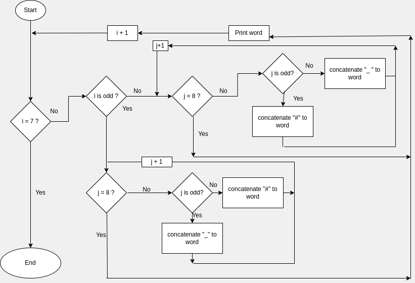

# Chessboard


Write a program that creates a string that represents an 8×8 grid, using newline characters to separate lines. At each position of the grid there is either a space or a "#" character. The characters should form a chessboard.

Passing this string to console.log should show something like this:

```
 # # # #
# # # #
 # # # #
# # # #
 # # # #
# # # #
 # # # #
# # # #
```

When you have a program that generates this pattern, define a binding size = 8 and change the program so that it works for any size, outputting a grid of the given width and height.

## flowchart 

### step 1



### step 2

![flowchartTwo] (0302.png)


## Pseudocode

```
Procedure printChessboard
For each row from 1 to 7
  declare variable word = ' '
  if the row's number is odd
    for column from 0 to 7
      if the column's number is odd 
        add '_' to word
      else if it's even
        add '#' to word
    end column's loop
  else if it's even
    for each column from 1 to 8
      if the colmun's number is odd
        add '#' to word
      else if it's even
        add '_' to word
    end column's loop to word
  print word
end row's loop
    
```


## Code solution

```JS
'use strict';

for (let i = 0; i < 7; i += 1) {
  let word = '';
  if (i % 2 === 0) {
    for (let j = 0; j < 8; j += 1) {
      if (j % 2 === 0) {
        word += '#';
      } else {
        word += '_';
      }
    }
  } else {
    for (let j = 0; j < 8; j += 1) {
      if (j % 2 === 0) {
        word += '_';
      } else {
        word += '#';
      }
    }
  }

  console.log(word);
}
```