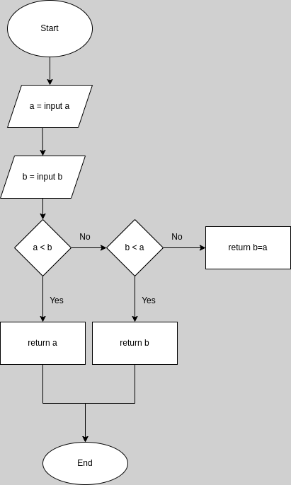

# Minimum

Write a function min that takes two arguments and returns their minimum.


```
console.log(min(0, 10));
// → 0
console.log(min(0, -10));
// → -10

```


## flowchart 



## Pseudocode

```
declare number1 <- Userinput1
declare number2 <- Userinput2
Function returnMinimum(input1, input2)
if number1 smallest than number2
  return "number 1 is minimum"
if number2 smallest than number1
  return "number 2 is minimum"
else 
  return "error: number2 is equal to number1"
End
```

## Code solution

```JS
const prompt = require('prompt-sync')();

const input1 = prompt('Prompt value1: ');
const input2 = prompt('Prompt value2: ');

function returnMinimum(value1, value2) {
  if (value1 < value2) {
    console.log(`${value1} is the lowest value`);
  } else if (value2 < value1) {
    console.log(`${value2} is the lowest value`);
  } else console.log('error: You\'re values are equal');
}

returnMinimum(input1, input2);

```