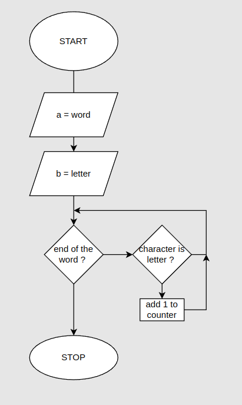

# Bean Counting

You can get the Nth character, or letter, from a string by writing "string"[N]. The returned value will be a string containing only one character (for example, "b"). The first character has position 0, which causes the last one to be found at position string.length - 1. In other words, a two-character string has length 2, and its characters have positions 0 and 1.

Write a function countBs that takes a string as its only argument and returns a number that indicates how many uppercase “B” characters there are in the string.

Next, write a function called countChar that behaves like countBs, except it takes a second argument that indicates the character that is to be counted (rather than counting only uppercase “B” characters). Rewrite countBs to make use of this new function.


```js

console.log(countBs("BBC"));
// → 2

console.log(countChar("kakkerlak", "k"));
// → 4
```

## flowchart 



## Pseudocode

```
function letterCounter: 
Prompt word in which you want to count the specified letter
Prompt letter you want to count
Declare a counter
For each character in word: 
    if character is letter
    add 1 to counter
Log counter to console
```

## Code solution 

```js

'use strict';

const prompt = require('prompt-sync')();

let counter = 0;
let word = prompt('Enter a word: ');
let letter = prompt('Enter a letter to count: ');

for (let i = 0; i < word.length; i += 1) {
  if (word[i] === letter) {
    counter += 1;
  }
}

console.log(counter);
```

