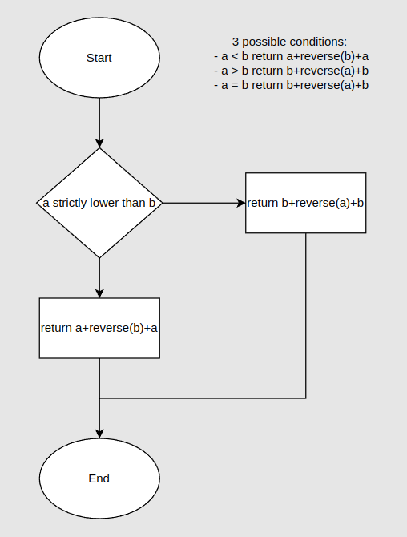

# shorter concat [reverse longer]

Given 2 strings, a and b, return a string of the form: shorter+reverse(longer)+shorter.

In other words, the shortest string has to be put as prefix and as suffix of the reverse of the longest.

Strings a and b may be empty, but not null (In C# strings may also be null. Treat them as if they are empty.).
If a and b have the same length treat a as the longer producing b+reverse(a)+b

## flowchart



## pseudocode   


```
function shorter_reverse_shorter: 
Compare the two word: 
  If word A longer than word B:
    return b + reverse(a) + b
  Else if word B longer than word A : 
    return b + reverse(a) + b
  Else if word are equal : 
    return b + reverse(a) + b
```
   
     
## code solution: 

```
function shorter_reverse_longer(a,b){
  return a.length >= b.length ? b + a.split('').reverse().join('') + b :
  a + b.split('').reverse().join('') + a;
}
```